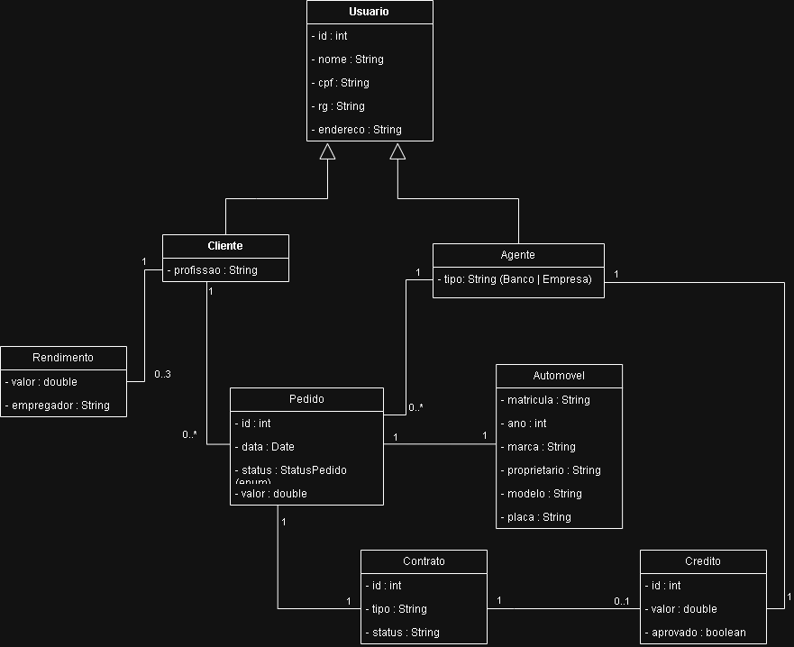
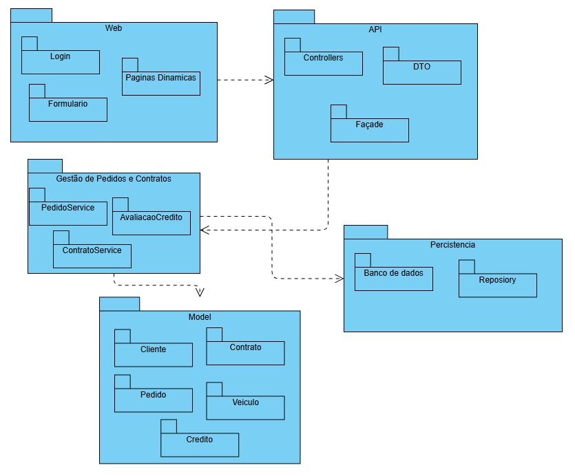
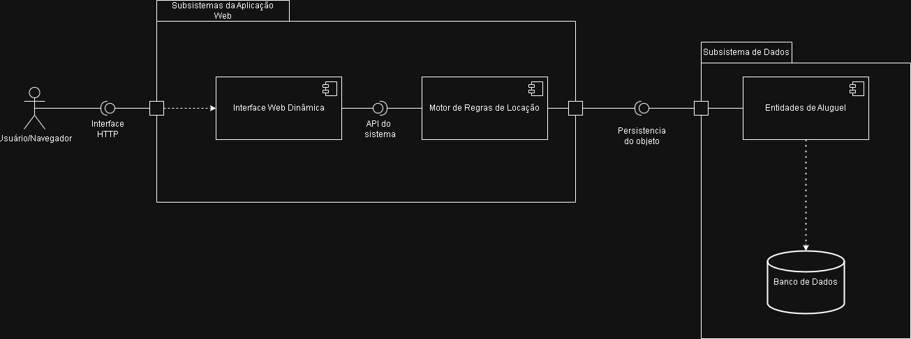

# 🏷️ Sistema de aluguel de carros

Sistema web desenvolvido para gerenciar o processo de aluguel de veículos, permitindo que clientes realizem solicitações de locação e que agentes realizem a análise e aprovação dos pedidos.

O projeto está sendo desenvolvido como parte da disciplina **Laboratório de Desenvolvimento de Software**.

---

## 🚧 Status do Projeto


[](https://github.com/Mateus7799/Lab-02-Sistema-de-Aluguel-de-Carros.git)

---

## 📚 Índice
- [Sobre o Projeto](#sobre-o-projeto)
- [Diagramas](#-diagramas)
- [Funcionalidades](#-funcionalidades-principais)
- [Autores](#-autores)
- [Tecnologias Utilizadas](#-tecnologias-utilizadas)


---
## 📝 Sobre o Projeto

Este projeto consiste no desenvolvimento de um sistema web para gerenciamento do processo de aluguel de veículos, permitindo a interação entre clientes e agentes responsáveis pela análise e aprovação das solicitações.

A aplicação tem como objetivo organizar e automatizar o fluxo de locação, desde o cadastro de usuários até a criação, acompanhamento e validação de pedidos de aluguel. Clientes podem realizar solicitações informando os dados necessários para a locação, enquanto agentes avaliam essas solicitações com base em critérios definidos, incluindo análise financeira e verificação de informações.

O sistema foi projetado com foco em organização, modularidade e clareza estrutural, utilizando conceitos de engenharia de software como modelagem UML, separação de responsabilidades e planejamento orientado a boas práticas de desenvolvimento.

Este projeto está sendo desenvolvido como parte da disciplina **Laboratório de Desenvolvimento de Software**, com o objetivo de aplicar na prática os conceitos estudados ao longo do curso.

**Principais características:**

- Cadastro e autenticação de usuários (clientes e agentes)
- Criação e gerenciamento de pedidos de aluguel
- Análise e aprovação de pedidos por agentes
- Organização modular baseada em boas práticas de engenharia de software

---

## 📷 Diagramas

### Diagrama de Casos de Uso


### Diagrama de Classes



### Diagrama de Pacotes



### Diagrama de Coponentes



---

## ✨ Funcionalidades Principais

- Cadastro e login de usuários
- Criação de pedidos de aluguel
- Consulta e atualização de pedidos
- Cancelamento de pedidos
- Análise financeira de pedidos
- Aprovação ou reprovação de contratos
  
---

## 👨‍💻 Autores

- Arthur Modesto Couto
- Bernardo Carvalho Denucci Mercado
- Mateus Azevedo Araújo
- Matheus Dias Mendes
  

## 📁 Estrutura do Projeto

```
Code/
├── backend/
│   ├── pom.xml
│   └── src/main/
│       ├── java/com/aluguel/
│       │   ├── model/
│       │   │   ├── Usuario.java        (PanacheEntity com nome, rg, cpf, endereco — heranca JOINED)
│       │   │   ├── Cliente.java        (extends Usuario com profissao + 3 rendimentos + totalRendimentos())
│       │   │   ├── Automovel.java      (marca, modelo, ano, placa, valorDiaria, status, urlImagem)
│       │   │   └── Pedido.java         (ManyToOne para Cliente e Automovel, datas, status, objetivo)
│       │   └── controller/
│       │       ├── AutomovelResource.java   (CRUD REST de veiculos)
│       │       ├── ClienteResource.java     (CRUD REST de clientes com validacao CPF/RG)
│       │       ├── PedidoResource.java      (CRUD REST de pedidos + logica de status)
│       │       ├── ClienteController.java   (MVC com Qute para listar/criar/editar via HTML)
│       │       └── IndexController.java     (redireciona / para /clientes)
│       └── resources/
│           ├── application.properties       (H2 em memoria, porta 8080, CORS configurado)
│           └── templates/
│               ├── listar.html              (tabela com busca, editar e excluir)
│               └── formulario.html          (formulario de cadastro/edicao com validacao CPF/RG)
│
└── frontend/
    ├── package.json
    ├── vite.config.js
    ├── tailwind.config.js
    ├── index.html
    └── src/
        ├── main.jsx                         (entry point, envolve App com AuthProvider)
        ├── App.jsx                          (configuracao de rotas com React Router)
        ├── api/
        │   ├── automoveis.js                (funcoes HTTP para /api/automoveis)
        │   ├── clientes.js                  (funcoes HTTP para /api/clientes)
        │   └── pedidos.js                   (funcoes HTTP para /api/pedidos)
        ├── context/
        │   └── AuthContext.jsx              (autenticacao mock com sessionStorage, perfis agente/cliente)
        ├── components/
        │   ├── Layout.jsx                   (sidebar + header com navegacao por perfil)
        │   ├── FormularioCliente.jsx        (formulario de criar/editar cliente com mascaras CPF/RG)
        │   ├── agente/
        │   │   └── ModalAutomovel.jsx       (modal de criar/editar veiculo)
        │   └── cliente/
        │       └── ModalPedido.jsx          (modal de solicitar aluguel)
        └── pages/
            ├── Login.jsx
            ├── SignUp.jsx
            ├── Listar.jsx                   (CRUD de clientes em tabela)
            ├── agente/
            │   ├── DashboardAgente.jsx      (KPIs: veiculos, pedidos, clientes, lucro)
            │   ├── EstoqueAgente.jsx        (gestao de veiculos com busca e modal)
            │   ├── PedidosAgente.jsx        (workflow de aprovacao de pedidos)
            │   └── PerfilAgente.jsx         (placeholder)
            └── cliente/
                ├── PortalCliente.jsx        (catalogo de veiculos disponiveis + pedidos recentes)
                ├── MeusPedidos.jsx          (historico de alugueis do cliente)
                └── PerfilCliente.jsx        (placeholder)


```


## 🚀 Como Executar

### Frontend

1. Acesse o a pasta frontend:
```bash
cd code/frontend
```

2. Execute primeiro o comando:
```bash
npm install
```
3. Depois de instalar as dependencas execute o comando:
```bash
npm run dev
```


### Backend

1. Acesse o a pasta backend:
```bash
cd code backend
```

2. Execute o comando:
```bash
./mvnw quarkus:dev
```
ou se tiver o maven instalado:
```bash
mvn quarkus:dev
```

## 🛠️ Tecnologias Utilizadas

* **Frontend:** React, Vite, Tailwind CSS.
* **Backend:** Quarkus, Java 17, Maven.
* **Banco de Dados:** H2 Database (In-memory).

---
